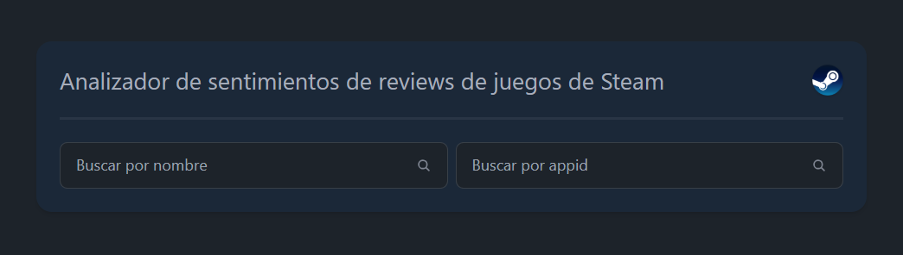
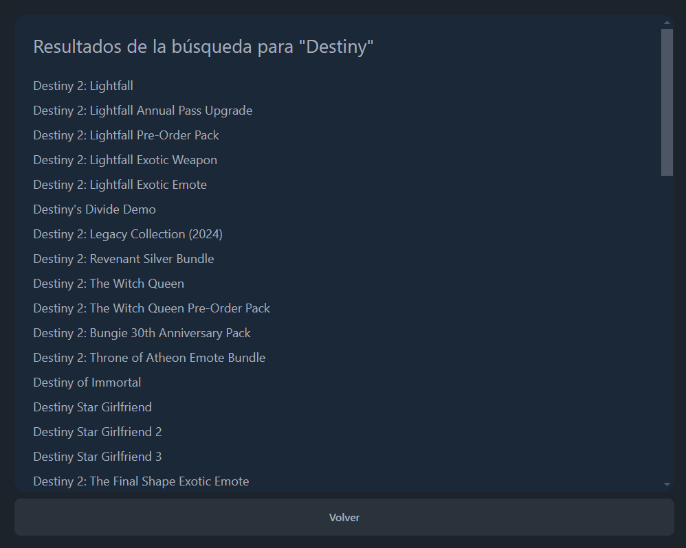
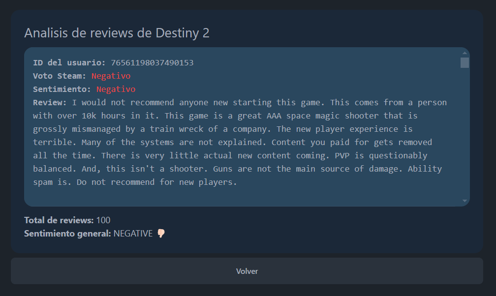

# Proyecto de Análisis de sentimientos de reviews de Steam con IA 🤖.

En este proyecto trabajamos con el pipeline de `trasnformers` `('sentiment-analysis')` para determinar si las reviews de un juego son positivas, negativas o neutrales.

## Estructura del proyecto
En este proyecto tenemos tanto un cuaderno jupyter para probar la funcionalidad como una aplicación Flask para tener la funcionalidad en una WebUI.

## Guía de instalación/arranque WebUI
Ejecutaremos los siguentes comandos:


1. Instalamos las dependencias del WebUI
 ```sh 
   pip install -r requirements.txt
   ```

```sh
npm install
```
2. Compilamos los estilos
```sh
npm run build:css
```

3. Arrancamos Flask
```sh
python3 ./app.py
```

## Guía de uso WebUI
En la primera pantalla encontraremos dos inputs.



En el primero podremos introducir el nombre de un juego y en caso de tener varias coincidencias se nos mostrará una lista donde podremos seleccionar el juego deseado.



En el segundo podremos introducir directamente el appID del juego.

Una vez tenemos nuestros juego seleccionado, por cualquiera de las dos vías anteriores, pasaremos a la página de las reviews, donde podremos ver un listado con las 100 reviews más relevantes (en caso de que tenga 100 o más, si no, se mostrarán las que haya).

> Las reviews más relevantes la  determina la API de Steam en función de los votos y la opinion del creador.



En cada review veremos el ID del autor, el voto en steam de la review y el sentimiento que ha determinado el modelo.

Además debajo de la caja de reviews, tenemos el total de reviews analizadas y el sentimiento general.

> El sentimiento general se calcula contando cuantas reseñas son analizadas con cada sentimiento y calculando la media usando el 'score' como peso.